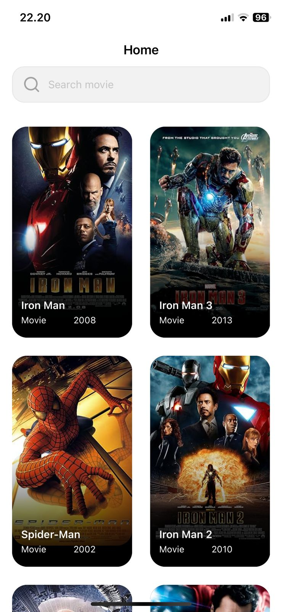
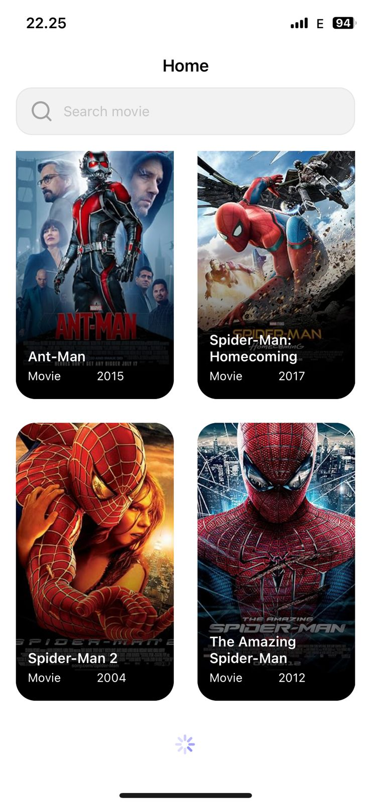
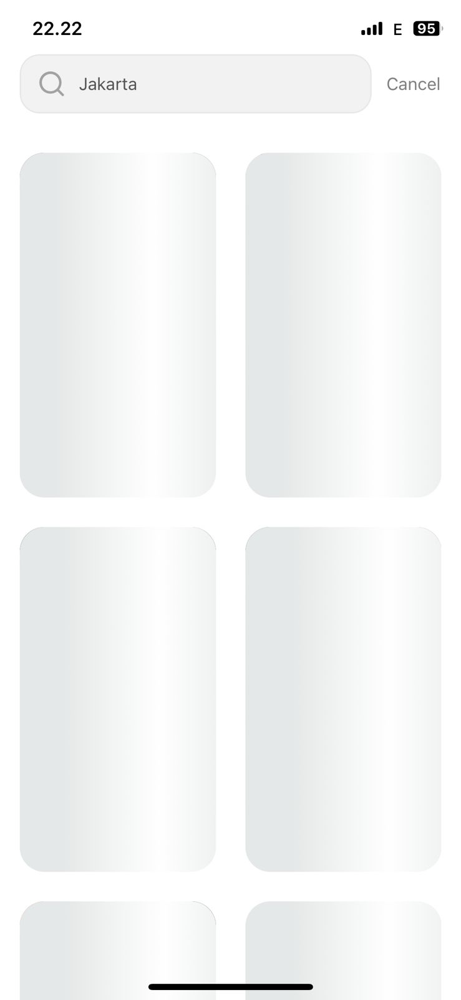
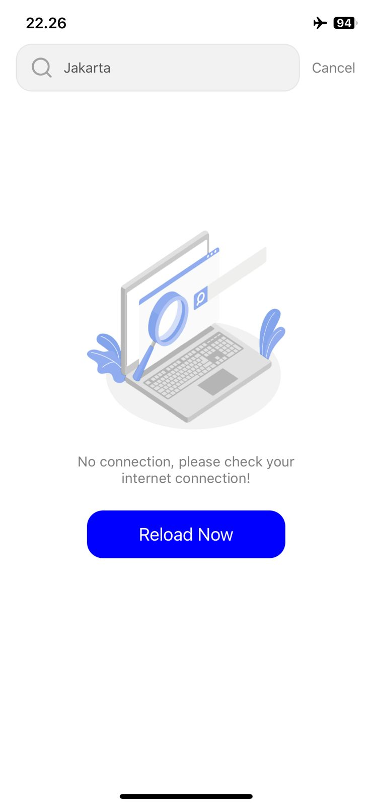
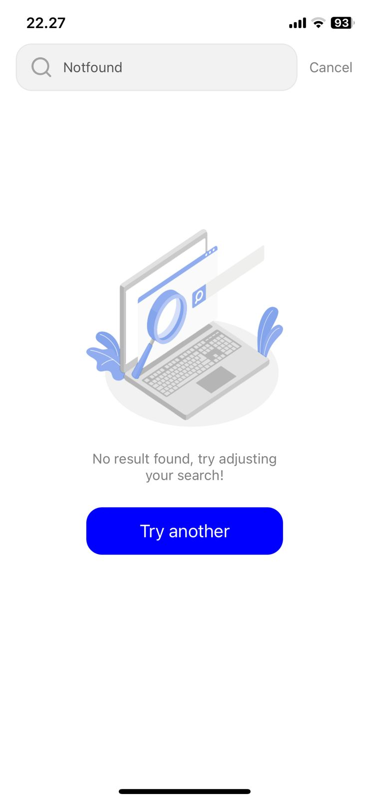

<!-- PROJECT LOGO -->
<br />
<div>
<h3>Simple Movie Anjas</h3>
</div>

<!-- TABLE OF CONTENTS -->
<details>
  <summary>Table of Contents</summary>
  <ol>
    <li>
      <a href="#about-the-project">About The Project</a>
      <ul>
        <li><a href="#dependencies">Dependencies</a></li>
      </ul>
    </li>
    <li>
      <a href="#requirements">Requirements</a>
    </li>
    <li><a href="#installation">Installation</a></li>
    <li><a href="#tech-stack">Tech stack</a>
        <ul>
            <li><a href="#mvvm">MVVM</a></li>
            <li><a href="#domain-specific-language">Domain Specific Language</a></li>
            <li><a href="#programmatically">Programmatically</a></li>
            <li><a href="#reactive-programming-swift">Reactive Programming Swift</a></li>
            <li><a href="#snapkit">Snapkit</a></li>
            <li><a href="#compositional-layout">Compositional layout</a></li>
        </ul>
    </li>
  </ol>
</details>


<!-- ABOUT THE PROJECT -->
## About The Project

This project was created to fulfill the requirements of the app coding challenge.

   

### Dependencies
* <b>Reactive programming: RxSwift, RxCocoa, RxTapGesture, RxDataSources, RxTest</b>
* <b>Network Service: Alamofire</b>
* <b>SnapKit</b>
* <b>SDWebImage</b>
* <b>SkeletonView</b>
* <b>ReachabilitySwift</b>


<!-- GETTING STARTED -->
## Requirements

This project built using cocoapod as package manager, so please install cocoapod first on your mac.
  ```sh
  sudo gem install cocoapods
  ```
 Follow <a href="#readme-top">this page</a> to see more the cocoapod installation details.

## Installation

1. Clone the repo
   ```sh
   git clone https://github.com/anjasdwi/SimpleMovieAnjas.git
   ```
2. Open the root project using command line terminal, then install using pod
   ```sh
   pod install
   ```
3. Open the .xcworkspace format file

## Tech stack
There are several methods and libraries used to build this project. Some highlights that are quite important to know are the following:

### MVVM
The main advantage of using MVVM architecture is i have a concern separator between view and business logic. It makes app more testable, maintainable, and scalable.

### Domain Specific Language
Simplify UIKit with by adopting the Domain Specific Language method like SwiftUI make the code more readable and efficient. Utilizing swift result builder and Withable custom protocol to help me to create an object and config their own properties easily.

### Programmatically
Almost all the UI in this project created by programmatically because in my opinion, this provides several advantages, including being able to provide full control over view loading based on specific conditions.

### Reactive Programming Swift
Using Rxswift, RxCocoa, RxDataSources, and RxGesture as a library for reactive programming. This can create more efficient and scalable applications that can easily handle real-time changes and react to events. Rxswift's declarative code approach also makes the code more readable.

### Snapkit
Snapkit for simplifies the process of Auto Layout. Again and again related in declarative method. Snapkit's declarative code approach makes the code more readable and maintainable.

## Contact

Anjas Dwi - anjasdwi.id@gmail.com

Project Link: [https://github.com/anjasdwi/SimpleMovieAnjas](https://github.com/anjasdwi/SimpleMovieAnjas)

<p align="right">(<a href="#readme-top">back to top</a>)</p>
